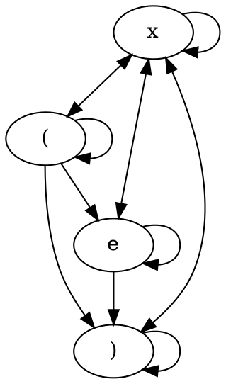

# A Simple Lisp-like Configuration Language

Let's build a simple formal grammar for this language. The language's alphabet is comprised of unicode characters, \\\(\mathbb{U}\\\). The language needs to have:

- Tokens, made of characters and separated by a separator
- Scope (dictated by `(` and `)`)

Here are some definitions:
$$
\displaylines{S \\\
N = \lbrace T\rbrace \\\
\mathbb{X} = \lbrace \text{space}, \text{tab}, \text{newline} \rbrace\\\
\Sigma = \mathbb{U} - \mathbb{X} - \lbrace\ (, )\rbrace \\\
P = \begin{cases}
      S \rightarrow \varepsilon\ |\ SxS\ |\ (S)\ |\ T \\\ 
      T \rightarrow eT\ |\ e
\end{cases}
}
$$
There are two production rules, they are

> Start Rule: transforms S to one of
>
> - \\\(\varepsilon\\\)
> - S followed by a separator \\\(x \in \mathbb{X}\\\) followed by another S
> - S scoped up 1 level
> - Token Rule T


> Token Rule: transforms T to one of
>
> - Any member of \\\(e \in \Sigma\\\) followed by another T
> - Any member of \\\(e \in \Sigma\\\)

Because there are only non-terminal tokens on the LHS of all the production rules, this is a context-free grammar.

## State Transitions



You might notice that we can't transition from e directly to the scope open, or from the scope close to e. This isn't something that would break the language, but I'm not sure how to write the production rules for this in a clean way. So, for simplicity, we require \\\(Sx(\\) and \\\()xS\\) rather than \\\(S(\\) and \\\()S\\).

## Examples

```
dave (
	id (13556416678)
	age (30)
)

michael (
	id (14242343423)
	age (24)
)

jenny ()
```

When we say we want to 'access' a token, what we're really saying is we are interested in every step in the subset of the decision tree used to generate the token. Example:

```
S -> S S -> S (S) -> S (S S)) -> S (S (S)) -> michael (S (S)) -> michael (age (S)) -> michael (age (24))
```

Here each repetitive application of the token production rule is considered one rule application.

### Querying

To query the string, we simply provide this subset we are interested in (the query), and return all children of the query.

`michael(age)` -> `24`

`dave` -> `id (13556416678) age (30)`  

`jenny` -> `()`

## Creating a Parser

### LR(1) Parser

There are several approaches we can take to the parser.  Here is a functioning LR(1) parser with Python:

```C
in_X = lambda c: c in [' ', '\t', '\n']
in_E = lambda c: not(c in [' ', '\t', '\n', '(', ')'])

def cat(c):
    if in_X(c): return 'x'
    if in_E(c): return 'e'
    return c

def parse(input:str):
    input = ' ' + input + ' ' # Pad so we guarantee a x->* and *->x transition
    output = []
    depth = 0
    while (len(input) > 1):
        head = output
        for x in range(depth):
            head = head[-1]
        match (cat(input[0]), cat(input[1])):
            case ('x', 'x') | (')', 'x') | ('(', 'x'): pass
            case ('x', 'e') | ('(', 'e'): head.append(str())
            case ('e', 'e') | ('e', 'x'): head[-1] += input[0]
            case ('x', ')') | (')', ')'): depth -= 1
            case ('(', ')'): head.append([])
            case ('(', '(') | ('x', '('):
                head.append([])
                depth += 1
            case ('e', ')'):
                head[-1] += input[0]
                depth -= 1
            case _: raise RuntimeError(f"Unexpected transition {input[0]} -> {input[1]}")
        if depth < 0: raise RuntimeError(f"A closing ) was never opened!")
        input = input[1:]
    if depth > 0: raise RuntimeError(f"An opening ( was never closed!")
    return output
```

Note that each pair above corresponds to one of the 13 possible state transitions. This is probably the most explicit way to show the transitions, but if we're willing to look at `input[0]` and `input[1]` independently, we can simplify this to a `LR(0)` parser that also considers the state of `head`.

### LR(0) Parser

Using the same definitions above, we can rewrite `parse`:

```python
def parse(input:str):
    output = []
    depth = 0
    while (len(input) > 0):
        head = output
        head_parent = None # Hack since strings in python pass by copy
        for x in range(depth):
            head_parent = head
            head = head[-1]
        match (cat(input[0]), type(head) == list):
            case ('x', True): pass
            case ('x', False): depth -= 1
            case (')', True): depth -= 1
            case (')', False): depth -= 2
            case ('e', False): head_parent[-1] += input[0] # Reference to original string
            case ('e', True):
                head.append(input[0])
                depth += 1
            case ('(', True):
                head.append([])
                depth += 1
            case _: raise RuntimeError(f"Unexpected character {input[0]}")
        if depth < 0: raise RuntimeError(f"A closing ) was never opened!")
        input = input[1:]
    if depth > 0: raise RuntimeError(f"An opening ( was never closed!")
    return output
```

We have to do a bit of type hackery in python - True refers to list type, and False refers to str type. But, it is possible to write a parser that isn't lookahead for this grammar.

### LR(0) Pushdown Parser

We can also build a recursive parser for this language that uses the stack arguments to look through the input string. The parser recurses once for each opening scope, then skips the characters the inner function call parsed:

```python
def parse(input:str, output:list, scoped=False, charsread=0):
    output.append('')
    while (len(input) > 0):
        if in_E(input[0]): output[-1] += input[0]
        elif output[-1] != '': output.append('')

        if input[0] == ')':
            if not scoped: raise RuntimeError(f"A closing ) was never opened!")
            if output[-1] == '': del output[-1]
            return charsread

        if input[0] == '(':
            if output[-1] == '': del output[-1]
            else: raise RuntimeError(f"Unexpected character {input[0]}")
            output.append([])
            diff = 1 + parse(input[1:], output[-1], True)
            charsread += diff
            input = input[diff:]

        input = input[1:]
        charsread += 1

    if scoped: raise RuntimeError(f"An opening ( was never closed!")
    if output[-1] == '': del output[-1]
```

Note the output is now passed by reference, and the function now returns the number of characters it was able to parse. This `LR(0)` parser relies on the presence or absence of an empty string `''` at the end of `output` instead of the previous one, which relied on the type of `head`. It would also be possible to write a recursive `LR(1)` parser which only looks at two characters, but I'm not going to do that here.

## Parsing a Query

Let's continue using our third definition of `parse` and parse a config file:

```python
config:str = """
dave (
    id (13556416678)
    age (30)
)

michael (
    id (14242343423 (nestedthing))
    age (24)
)

jenny ()
"""

parsed = []
parse(config, parsed)
print(parsed)
```

This will parse the config and print the resulting array `parsed`:

```
['dave', ['id', ['13556416678'], 'age', ['30']], 'michael', ['id', ['14242343423'], 'age', ['24']], 'jenny', []]
```

If we have a query in the same format, we can search the config recursively for entries matching the query:

```python
cfg = []
parse(config, cfg)
print(cfg)

query = []
parse('dave', query)
print(query)

def search(cfg, query):
    result = []
    for item in query:
        if type(item) == str: # Root query
            result += [cfg[cfg.index(item) + 1]]
        if type(item) == list: # Subquery
            subcfg = result[-1]
            del result[-1]
            result.append(*search(subcfg, item))
    return result

print(search(cfg, query))
```

If we run this with different queries, we get:

```
'dave' -> [['id', ['13556416678'], 'age', ['30']]]
'dave (id)' -> [['13556416678']]
'dave jenny' -> [['id', ['13556416678'], 'age', ['30']], []]
'jenny dave (id)' -> [[], ['13556416678']]
'michael (id (14242343423))' -> [['nestedthing']]
```

We don't do any error handling here, which is fine; If we give it a malformed query, Python will throw an exception:

```
'jenny (id) dave (id)' -> ValueError: 'id' is not in list
```

That's enough for now. I might follow up with a simple lisp implementation in Python.
