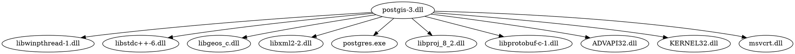

# PostGIS Analysis: Part 1/X

I want to build PostGIS (Geospatial DB extension for PostgreSQL) on Windows using MSVC and CMake. Before I get to actually writing any CMake, it will serve us well to understand what's actually in the PostGIS binaries. So, I'm going into this sort of blind and using it as an excuse to do a case study in dependency analysis.

For this post, I'm going to be using the popular dependency analyzer tool [Dependencies](https://lucasg.github.io/Dependencies/).

The binaries I'll be looking at come prebuilt for PG16 from [the osgeo mirror for 3.4.2](https://download.osgeo.org/postgis/windows/pg16/). These binaries might change in the future or past; if that is the case, please contact the Time Variance Authority and have them set the timeline of your universe so that this is the latest version of PostGIS.

Let's stat the files that come in this release... here is the result for `tree . /F` (omitting everything except the relevant directories with binaries, for brevity)

```
POSTGIS-PG16-BINARIES-3.4.2W64GCC81
│   makepostgisdb_using_extensions.bat
│   README.txt
│   version.txt
│
├───bin
│   │   libcrypto-3-x64.dll
│   │   libcurl-4.dll
│   │   libexpat-1.dll
│   │   libfreexl-1.dll
│   │   libgcc_s_seh-1.dll
│   │   libgdal-34.dll
│   │   libgeos.dll
│   │   libgeos_c.dll
│   │   libiconv-2.dll
│   │   libopenjp2.dll
│   │   libpcre-1.dll
│   │   libproj_8_2.dll
│   │   libprotobuf-c-1.dll
│   │   libSFCGAL.dll
│   │   libsqlite3-0.dll
│   │   libssl-3-x64.dll
│   │   libstdc++-6.dll
│   │   libtiff-6.dll
│   │   libtiffxx-6.dll
│   │   libxml2-2.dll
│   │   pgsql2shp.exe
│   │   pgtopo_export
│   │   pgtopo_import
│   │   raster2pgsql.exe
│   │   shp2pgsql.exe
│   │   zlib1.dll
│   │
│   └───postgisgui (Omitted)
│
├───gdal-data (Omitted)
│
├───lib
│       address_standardizer-3.dll
│       postgis-3.dll
│       postgis_raster-3.dll
│       postgis_sfcgal-3.dll
│       postgis_topology-3.dll
│
├───share (Omitted)
│
└───utils (Omitted)
```

We can see there are 5 main libraries for the project; there are also a few executables native to the project in `bin/`, along with some libraries that are needed for the project binaries to link against.

## Cracking open postgis-3

Let's open the most important lib, postgis-3 in Dependencies.


There are two main windows we care about, (1) the module list and (2) the function list. The first tells us the other binaries postgis-3 expects to be able to load at runtime.

The libraries shown in red cannot be found either in the system DLLs, or in any directory in the PATH. We could fix that but it's not a big deal.

The second tells us all of the functions exposed in postgis-3, along with their addresses and some other info. This will come in handy later to help us build a map from translation units to libraries.

For now though, lets just build a dependency graph of all the libraries. For just postgis-3, without following deps recursively, the graph would look like this:



Let's build this out a bit more though. I'm not going to show the GUI for the other libs. In fact, it's much easier to build the graph by dumping the deps with the following powershell command: `dependencies -depth 1 -modules <TARGET>.dll`

Let's try again, this time we follow dependencies recursively until we hit a binary not released as part of PostGIS:

```graphviz
digraph G {
    "postgis-3.dll" -> "libwinpthread-1.dll"
    "postgis-3.dll" -> "libstdc++-6.dll"
    "postgis-3.dll" -> "libgeos_c.dll"
    "postgis-3.dll" -> "libxml2-2.dll"
    "postgis-3.dll" -> "postgres.exe"
    "postgis-3.dll" -> "libproj_8_2.dll"
    "postgis-3.dll" -> "libprotobuf-c-1.dll"
    "postgis-3.dll" -> "ADVAPI32.dll"
    "postgis-3.dll" -> "KERNEL32.dll"
    "postgis-3.dll" -> "msvcrt.dll"
    
    "libstdc++-6.dll" -> "KERNEL32.dll"
    "libstdc++-6.dll" -> "msvcrt.dll"
    "libstdc++-6.dll" -> "USER32.dll"
    "libstdc++-6.dll" -> "libgcc_s_seh-1.dll"
    "libstdc++-6.dll" -> "libwinpthread-1.dll"
    
    "libgcc_s_seh-1.dll" -> "KERNEL32.dll"
    "libgcc_s_seh-1.dll" -> "msvcrt.dll"
    "libgcc_s_seh-1.dll" -> "libwinpthread-1.dll"
    
    "libgeos_c.dll" -> "KERNEL32.dll"
    "libgeos_c.dll" -> "msvcrt.dll"
    "libgeos_c.dll" -> "libgcc_s_seh-1.dll"
    "libgeos_c.dll" -> "libstdc++-6.dll"
    "libgeos_c.dll" -> "libgeos.dll"
    "libgeos_c.dll" -> "libwinpthread-1.dll"
    
    "libgeos.dll" -> "KERNEL32.dll"
    "libgeos.dll" -> "msvcrt.dll"
    "libgeos.dll" -> "libgcc_s_seh-1.dll"
    "libgeos.dll" -> "libstdc++-6.dll"
    "libgeos.dll" -> "libwinpthread-1.dll"
    
    "libxml2-2.dll" -> "kernel32.dll"
    "libxml2-2.dll" -> "MSVCRT.dll"
    "libxml2-2.dll" -> "WS2_32.dll"
    
    "libproj_8_2.dll" -> "KERNEL32.dll"
    "libproj_8_2.dll" -> "msvcrt.dll"
    "libproj_8_2.dll" -> "SHELL32.dll"
    "libproj_8_2.dll" -> "libgcc_s_seh-1.dll"
    "libproj_8_2.dll" -> "libstdc++-6.dll"
    "libproj_8_2.dll" -> "libcurl-4.dll"
    "libproj_8_2.dll" -> "libsqlite3-0.dll"
    "libproj_8_2.dll" -> "libtiff-6.dll"
    
    "libcurl-4.dll" -> "ADVAPI32.dll"
    "libcurl-4.dll" -> "CRYPT32.dll"
    "libcurl-4.dll" -> "KERNEL32.dll"
    "libcurl-4.dll" -> "msvcrt.dll"
    "libcurl-4.dll" -> "WLDAP32.dll"
    "libcurl-4.dll" -> "WS2_32.dll"
    "libcurl-4.dll" -> "libcrypto-3-x64.dll"
    "libcurl-4.dll" -> "libssl-3-x64.dll"
    "libcurl-4.dll" -> "zlib1.dll"
    "libcurl-4.dll" -> "libwinpthread-1.dll"
    
    "libcrypto-3-x64.dll" -> "ADVAPI32.dll"
    "libcrypto-3-x64.dll" -> "KERNEL32.dll"
    "libcrypto-3-x64.dll" -> "msvcrt.dll"
    "libcrypto-3-x64.dll" -> "USER32.dll"
    "libcrypto-3-x64.dll" -> "WS2_32.dll"
    
    "zlib1.dll" -> "KERNEL32.dll"
    "zlib1.dll" -> "msvcrt.dll"
    
    "libssl-3-x64.dll" -> "KERNEL32.dll"
    "libssl-3-x64.dll" -> "msvcrt.dll"
    "libssl-3-x64.dll" -> "libcrypto-3-x64.dll"
    
    "libsqlite3-0.dll" -> "KERNEL32.dll"
    "libsqlite3-0.dll" -> "msvcrt.dll"
    
    "libtiff-6.dll" -> "KERNEL32.dll"
    "libtiff-6.dll" -> "msvcrt.dll"
    "libtiff-6.dll" -> "USER32.dll"
    "libtiff-6.dll" -> "zlib1.dll"
    
    "libprotobuf-c-1.dll" -> "KERNEL32.dll"
    "libprotobuf-c-1.dll" -> "msvcrt.dll"
    "libprotobuf-c-1.dll" -> "USER32.dll"
}
```



This turned into absolute spaghetti, but the point of making this graph wasn't mainly for it to look good. If you look at the graphviz source, every node on the LHS represents a library we care about building as part of PostGIS:

```
postgis-3.dll
libstdc++-6.dll
libgcc_s_seh-1.dll
libgeos_c.dll
libgeos.dll
libxml2-2.dll
libproj_8_2.dll
libcurl-4.dll
libcrypto-3-x64.dll
zlib1.dll
libssl-3-x64.dll
libsqlite3-0.dll
libtiff-6.dll
libprotobuf-c-1.dll
```

I'm omitting entries from `libwinpthread-1.dll` and `postgres.exe` here, I don't think they are required. Postgres of course must be installed (the headers to compile against, and the libraries) but we don't really care about that at the moment.

## Mapping Translation Units

The next thing we want to do is try and map translation units (C/C++ source files, loosely speaking) to each library. We mainly only care about the ones for `postgis-3.dll`, but also care about anything built as part of the build process.

Here I am going to use some absolute powershell hackery to generate the list of header files for each symbol declaration, so bear with me:

```powershell
$sourcedir = "<sourcedir>\postgis"
dependencies -depth 1 -exports postgis-3.dll | foreach-object {
	if ($_.contains("Name :")) {
		$funname = $_.Substring(9)
		$headers = (ls -r $sourcedir *.h | select-string "$funname\(")
		if ($headers) {($funname + " -> " + $headers).Replace($sourcedir + '\', '').Split('.h')[0] + '.h'}
	}
}
```

There are some issues with this. It only matches the first header file with matching text to each function name, it doesn't actually parse the header file. I also feel as though it generates less matches than it should, but it's useful as a starting point. Here is a sample of just the first lines of output:

```
ARRAY2GEOS -> lwgeom_geos.h
ARRAY2LWGEOM -> lwgeom_geos.h
BOX3D_above -> lwgeom_box3d.h
BOX3D_above_internal -> lwgeom_box3d.h
BOX3D_back -> lwgeom_box3d.h
BOX3D_back_internal -> lwgeom_box3d.h
BOX3D_below -> lwgeom_box3d.h
BOX3D_below_internal -> lwgeom_box3d.h
BOX3D_combine -> lwgeom_box3d.h
...
```

Since there are many function definitions per header file, let's just look at the set of all header files this yields:

```
flatgeobuf.h
geobuf.h
geography.h
geography_measurement_trees.h
gserialized_spgist_3d.h
lwgeom_box3d.h
lwgeom_geos.h
lwgeom_geos_prepared.h
lwgeom_itree.h
mvt.h
postgis_brin.h
```

I'll find some way to refine this process later on, maybe with actual parsing tools. A bunch of stuff is missing... but, this gives us a starting point. Our build of `postgis-3.dll` just has to bundle the source files with the definitions matching all the declarations found in these header files.