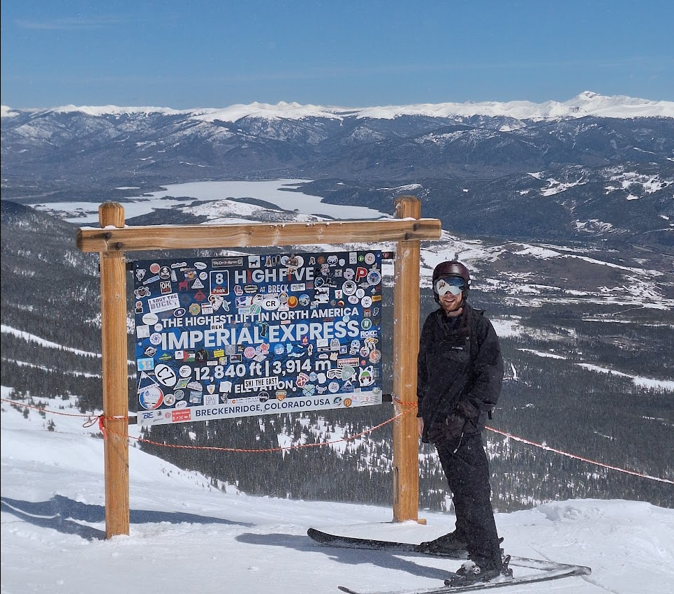

# About Me

Hi, I'm Will. I sometimes go by Ralian online. I graduated from Auburn University in 2020 with a B.Sc in Physics and a B.Eng in Computer Engineering.

I am currently a software engineer at [Trimble Maps](https://maps.trimble.com/) where I work on high-performance software for GIS applications using C/C++, postgresql, ruby, and python. For tooling, we use Docker, Jenkins, and Nomad to manage pipelines for our builds and support jobs.

In my spare time, I do some gamedev and language development. I also developed this site from scratch rather than building off an existing CMS; using only a few JS libraries it reflectively loads and parses each page from a markdown source. Feel free to fork it or steal it; just provide attribution!

In terms of non-software hobbies, I am an avid skiier:

I also love hiking, writing, drawing, and cooking.